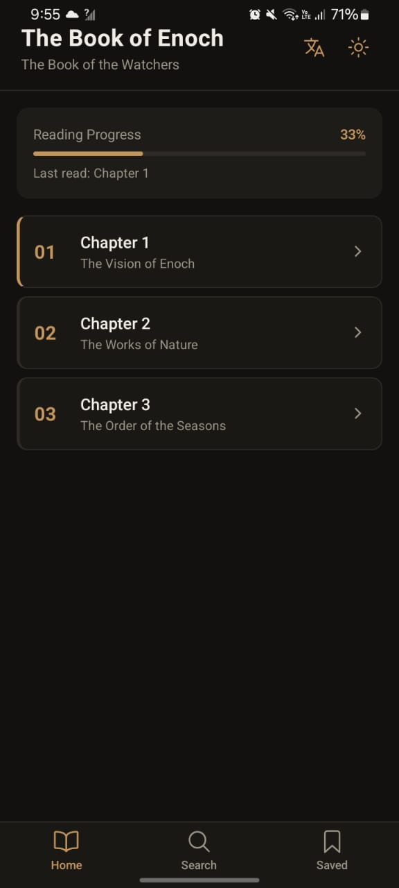
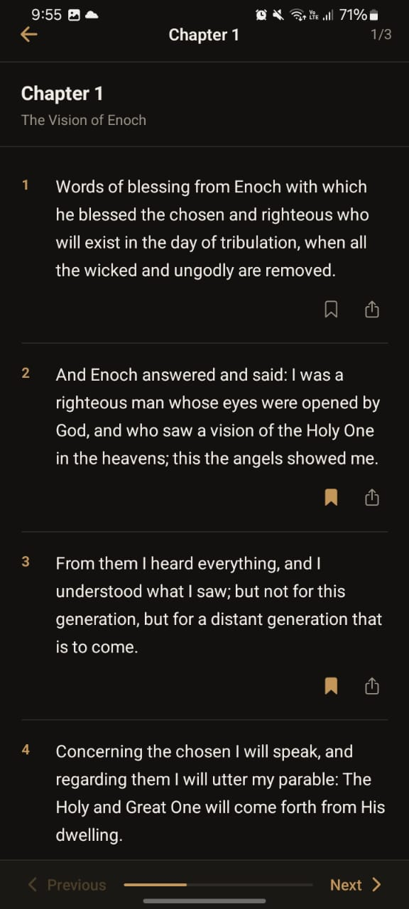
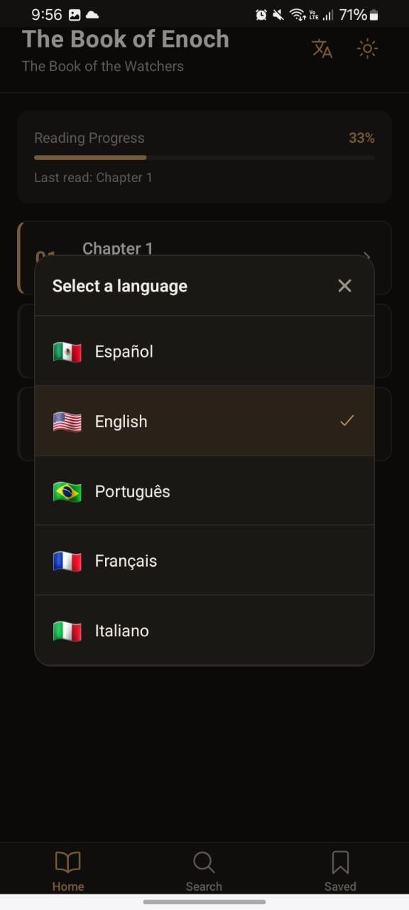
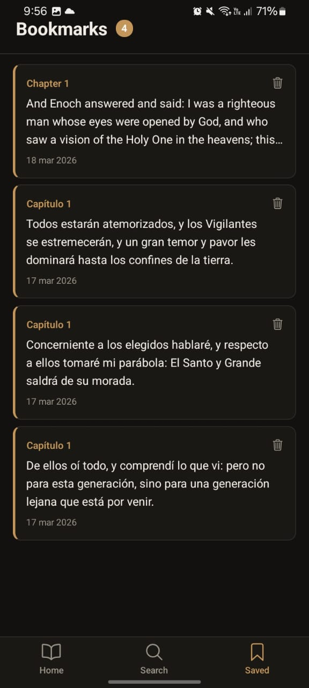
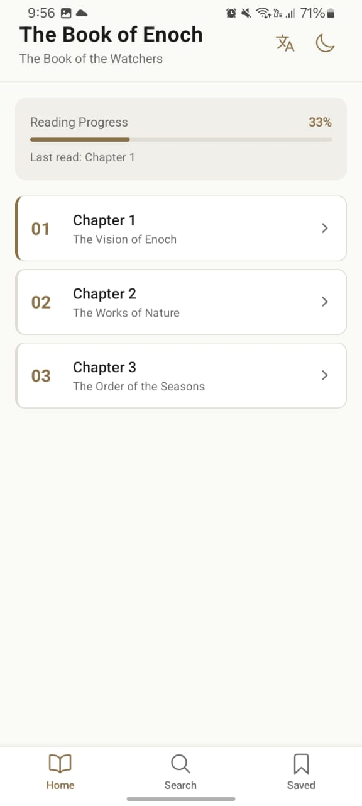

# 📖 expo-book-reader-template

A clean, production-ready React Native / Expo template for building book reader apps. Built with Expo Router, Zustand, and AsyncStorage — no backend required.

Originally built for **El Libro de Enoc App**, this template is designed to be reused across multiple book projects by swapping a few JSON files and a config file.

---

## ✨ Features

- 📚 Chapter navigation with horizontal swipe (like turning pages)
- 🔖 Bookmarks — save and manage verses/paragraphs
- 🔍 Full-text search with keyword highlighting
- 🌙 Dark / Light mode (persisted across sessions)
- 🌍 Multi-language support (ES, EN, PT, FR, IT) for both UI and book content
- 📊 Reading progress tracker
- 📤 Share verses natively
- 💾 All data persisted locally with AsyncStorage — no backend needed

---

## 🗂 Project Structure

```
src/
├── data/
│   ├── book.es.json         ← Book content in Spanish
│   ├── book.en.json         ← Book content in English
│   ├── book.pt.json         ← Book content in Portuguese
│   ├── book.fr.json         ← Book content in French
│   └── book.it.json         ← Book content in Italian
├── locales/
│   ├── es.ts                ← UI strings in Spanish
│   ├── en.ts                ← UI strings in English
│   ├── pt.ts                ← UI strings in Portuguese
│   ├── fr.ts                ← UI strings in French
│   └── it.ts                ← UI strings in Italian
├── store/
│   ├── useBookStore.ts      ← Bookmarks, progress, theme
│   └── useLanguageStore.ts  ← Selected language
├── hooks/
│   ├── useTheme.ts          ← Access current theme colors
│   ├── useTranslation.ts    ← Access current UI strings
│   └── useBookData.ts       ← Load book JSON for current language
├── components/
│   └── LanguageModal.tsx    ← Language selector modal
└── constants/
    └── theme.ts             ← Light and dark theme color definitions

app/
├── _layout.tsx              ← Root layout
├── (tabs)/
│   ├── _layout.tsx          ← Tab bar
│   ├── index.tsx            ← Home screen (chapter list)
│   ├── search.tsx           ← Search screen
│   └── bookmarks.tsx        ← Bookmarks screen
└── chapter/
    └── [id].tsx             ← Chapter reader screen
```

---

## 🚀 Getting Started

### 1. Clone the repo

```bash
git clone https://github.com/Motiph/expo-book-reader-template.git
cd expo-book-reader-template
```

### 2. Install dependencies

```bash
npm install --legacy-peer-deps
```

### 3. Start the app

```bash
npx expo start --clear
```

---

## 🔄 How to Reuse for a Different Book

To use this template for a different book, you only need to change a few files:

### Step 1 — Update `src/constants/theme.ts`

```typescript
export const LIGHT_THEME = {
  ...
  accent: '#8B6F47', // Change this to your preferred accent color
};

export const DARK_THEME = {
  ...
  accent: '#C4965A', // Change this to your preferred accent color for dark mode
};
```

### Step 2 — Replace the book JSON files

Each language has its own JSON file in `src/data/`. Replace the content with your book's text, keeping the same structure.

### Step 3 — Update UI strings in `src/locales/`

Each locale file (e.g. `en.ts`) contains the UI text for that language. Update any strings that reference the book name or specific terminology.

### Step 4 — Update `app.example.json > app.json`

```json
{
  "expo": {
    "name": "Your App Name",
    "slug": "your-app-slug",
    "android": {
      "package": "com.yourcompany.yourapp"
    },
    "ios": {
      "bundleIdentifier": "com.yourcompany.yourapp"
    }
  }
}
```

---

## 📄 Book JSON Structure

Each `book.xx.json` file must follow this structure:

```json
{
  "id": "unique-book-id",
  "title": "Book Title in This Language",
  "subtitle": "Book Subtitle in This Language",
  "chapters": [
    {
      "id": 1,
      "title": "Chapter 1",
      "subtitle": "Optional chapter subtitle",
      "paragraphs": [
        {
          "id": "1-1",
          "verse": 1,
          "text": "The text content of this verse or paragraph."
        },
        {
          "id": "1-2",
          "verse": 2,
          "text": "The text content of the next verse."
        }
      ]
    }
  ]
}
```

> ⚠️ **Important:** The `id` fields (`"1-1"`, `"1-2"`, etc.) must be identical across all language JSON files. Bookmarks are stored by `id`, so mismatched IDs will cause bookmarks to break when switching languages.

---

## 🌍 Adding a New Language

1. Create a new locale file in `src/locales/`, e.g. `de.ts`, following the same structure as the existing files.
2. Add a new book JSON file in `src/data/`, e.g. `book.de.json`.
3. Register the language in `src/locales/index.ts`:

```typescript
import de from './de';

export const locales = { es, en, pt, fr, it, de };

export const LANGUAGES = [
  ...
  { code: 'de' as Language, label: 'Deutsch', flag: '🇩🇪' },
];
```

4. Add the require in `src/hooks/useBookData.ts`:

```typescript
const books: Record<string, any> = {
  ...
  de: require('../data/book.de.json'),
};
```

---

## 🛠 Tech Stack

| Tool | Purpose |
|------|---------|
| [Expo](https://expo.dev) | React Native framework |
| [Expo Router](https://expo.github.io/router) | File-based navigation |
| [Zustand](https://zustand-demo.pmnd.rs) | State management |
| [AsyncStorage](https://react-native-async-storage.github.io/async-storage/) | Local data persistence |

---

## 📱 Built with this template

If you use this template to publish an app to the App Store or Play Store, I'd love to know! Send me the link so I can check it out and feature it here.

📬 **Share your app:** [Open an issue](https://github.com/YOUR_USERNAME/expo-book-reader-template/issues) with the title `[App Showcase]` and include your app's store link. I'll add it to this list!

### Apps built with this template

> *Be the first one! 🚀*

---

## 📜 License

MIT — free to use for personal and commercial projects.

---

## 📸 Screenshots
<p align="center">
  
  
  
  
  
</p>


## 🙏 Credits

Template created by [Motiph](https://github.com/Motiph).  
Content of *El Libro de Enoc* is in the public domain.